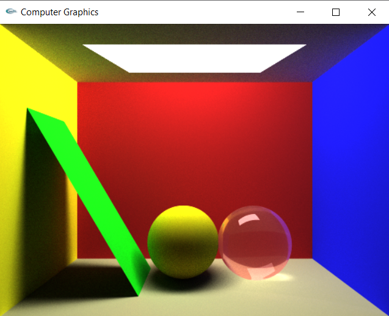

# Monte Carlo Path Tracing with Photon Mapping

In this project, I develop a Monte Carlo Path Tracer in C++ to simulate light transport in Cornell Box Scenes. The program supports a variety of material types like diffuse, specular, glossy, perfect mirrors and refractive. I use Photon Mapping to render the caustics in the scene like mirrors and refractive objects. In the rendering phase, I have used the Next Event Estimation technique by computing both direct and indirect lighting at each ray-geometry hit-point. The indirect light bounces are computed using Cosine Importance Sampling to improve sample efficiency. Finally, as a denoising technique, a scene-aware filter is used. An adaptive sampling method is also adopted to render high discrepancy pixels with higher priority than low discrepancy ones. The implementation also uses parallel threading to speed up the rendering time.

A brief report discussing the techniques used in the project is added in the .pdf file. You are encouraged to go through it!
   

  
### References:

[1]	James Kajiya, The Rendering Equation, SIGGRAPH 1986 
[2]	Arnold: A Brute-Force Production Path Tracer 
[3]	Daniel Heckenberg, Christopher Kulla, Marc Droske, Jorge Schwarzhaupt Path  tracing in Production, SIGGRAPH 2019 Course Notes 
[4]	Jason Lawrence: Importance Sampling of the Phong Reflectance Model 
[5]	E. Lafortune and Y. Willems. Using the modified Phong reflectance model for physically based rendering. Technical Report CW197, Dept. Comp. Sci., K.U. Leuven, 1994 
[6]	Eric Veach, Robust Monte Carlo Methods for Light Transport Simulation, 1997 
[7]	Wojciech Jarosz, Henrik Wann Jensen, Craig Donner: Advanced Global Illumination Using Photon Mapping, Siggraph 2008 Courses 
[8]	Robert Cook, Thomas Porter, Loren Carpenter, Distributed Ray Tracing 
[9]	https://www.scratchapixel.com/ 
[10]	Greg Humphreys, Wenzel Jakob, Matt Pharr -Physically Based Rendering, 3rd Edition 
[11]	Kavita Bala, Philippe Bekaert, Philip Dutre -Advanced Global Illumination, 2nd Edition 
